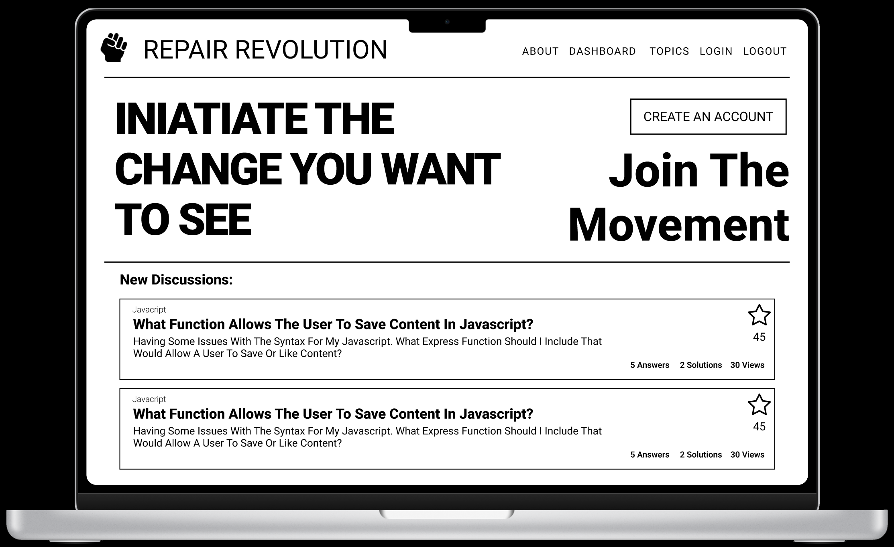
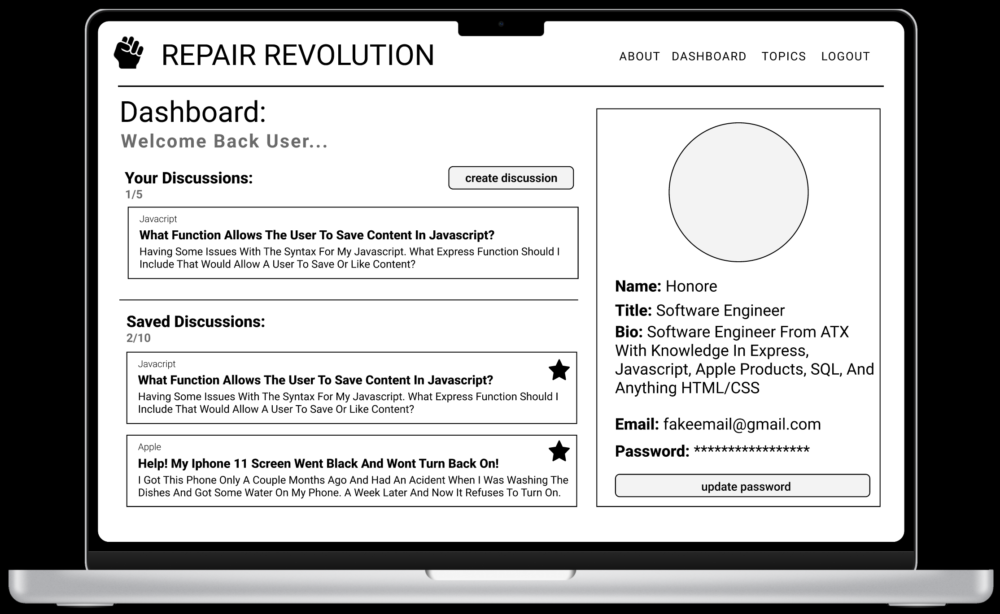
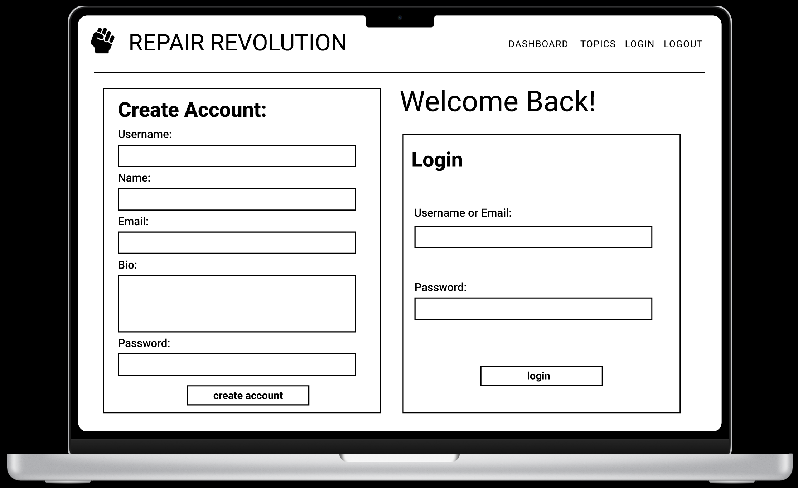
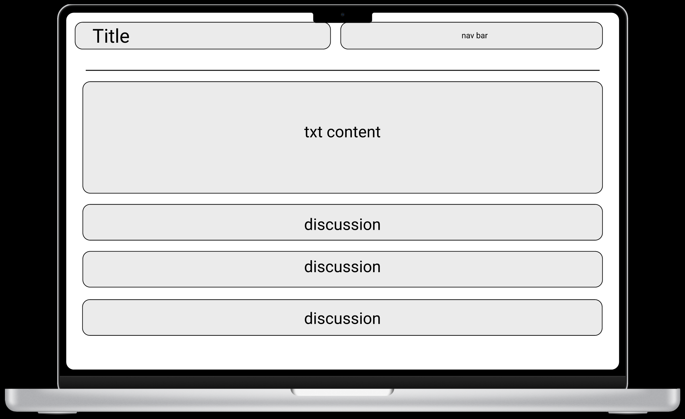
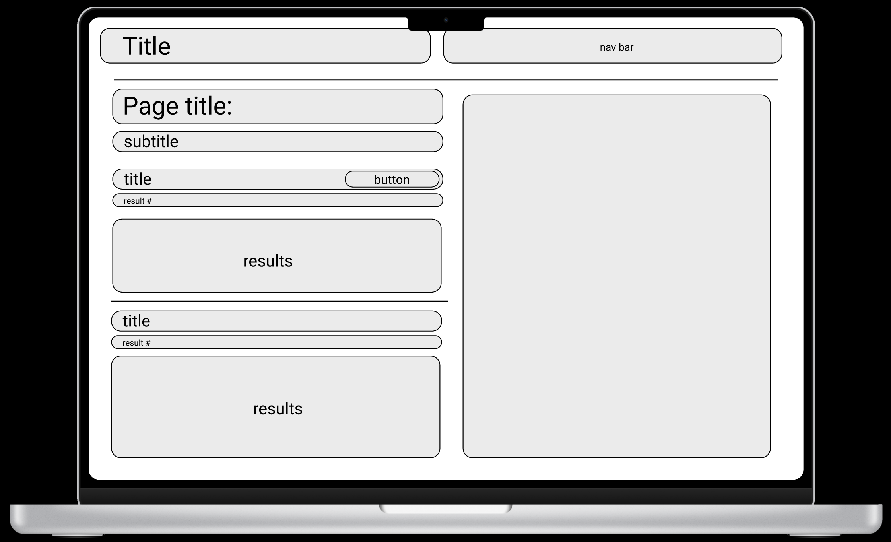
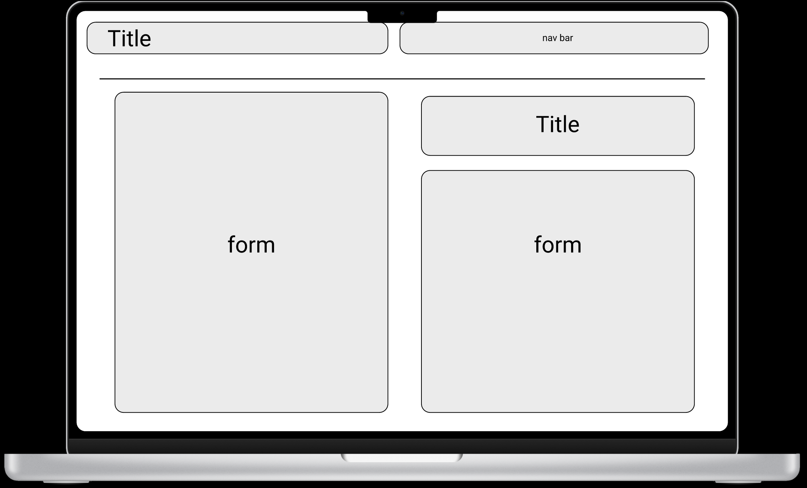

# Repair Revolution 

#### **Name:** Honore Nelson, Leland Byrd, Nadia Pagaduan, Lizbet Rivera, Lane Lopez
#### **Deployed Link:** https://repairrevolution.herokuapp.com/
#### **Github Repo:** https://github.com/mrlane51/Project2
---
    
##  Table of Contents:
* [Description](#description)
* [Walkthrough](#walkthrough)
* [Technologies Used](#technologies-used)
* [Design](#design)
* [Wireframe](#wireframe)
* [Usage Information](#usage)
* [Contribution Guidelines](#contribution-guidelines)
* [Authors](#authors)
* [License](#license)
* [Question](#questions)

## Description:
The purpose of this assignment was to come together as a group and create a full stack application, where a Restful Api was created utilizing Node.js and Express.js. Handlebars.js were also utilized as a template engine, which enables us to use static template files in the application. Repair Revolution is an application that seeks to give people more options to repair their own things. Users are able to create their accounts and log in. Once logged in they are presented with a dashboard containing their profile. In the dashboard, the user is able to create their own discussions by clicking on the create discussion form and filling out the topic, title and description. Within the dashboard the user also has access to other discussions that they have saved and are able to explore other topics and view new discussions.

## Technologies Used:
---
- **Bcrypt:** encripting user passwords to prevent hacking
- Sequelize
- **Dotenv:** loads environment varriables from our .env file to a process.env
- **Express:** Backend framework for node.js
- **Express-Handlebars:** View client-side data within our handlabars
- **Express-Session:** The application of cookies, and tracking of client-side login status
- **Find-Config:** 
- **MySQL2:** Database and storge of client-side information
- **nodemon:** Automatically launching our server.js to test funcationality of our application
- **materalize:** Create a clean and consise user interface

## Design:
---

> ### Deisgn Concept:
> we ideally wanted our design to be clean and simple, allowing for a clear and consise front end framework. 

## Wireframe:
---

## Usage:
---
Begin the application by opening the link provided (https://repairrevolution.herokuapp.com/), Create an account, and login! Want to add to this discussion? simply fill out the discussion form to ask a question about anything tech related!
     
    
## Contribution Guidelines:
---
Contribute to this project using the Github work flow model!

    
## Authors
---
* **Honore Nelson, Leland Byrd, Lane Lopez, Nadia Pagaduan, Lizbet Rivera** - *Initial work* - [Repair Revolution](https://github.com/mrlane51/Project2)
    
## License
---

This project is licensed under the MIT License - see the [LICENSE.md](LICENSE.md) file for details
  

## Question
---
Any additional question? Reach out via Github!
* Honore Nelson: https://github.com/matisses-goldfish
* Leland Byrd: https://github.com/Byrdbass
* Nadia Pagaduan: https://github.com/npagaduan
* Lizbett Rivera: https://github.com/rlizbett
* Lane Lopez: https://github.com/mrlane51

